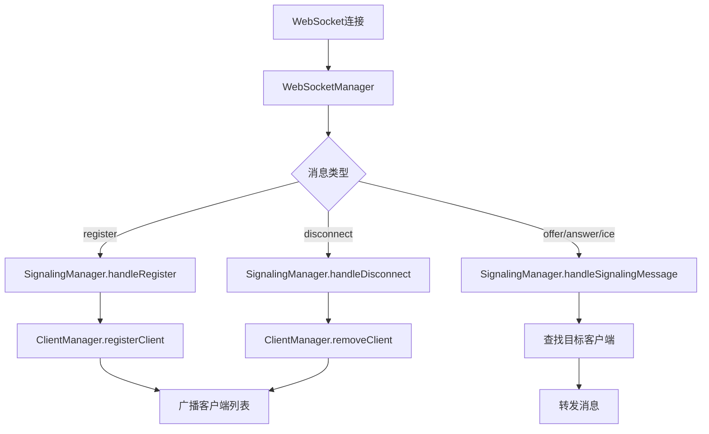

# 信令服务端架构说明

## 项目结构

重构后的信令服务端采用业务模块化的架构设计，按照业务职责进行了清晰的模块拆分。

```
server/src/
├── index.ts              # 应用入口文件
├── types/                # 类型定义
│   ├── client.ts         # 客户端相关类型
│   └── config.ts         # 配置相关类型
├── utils/                # 工具函数
│   └── index.ts          # 通用工具函数
├── services/             # 业务服务层
│   ├── index.ts          # 服务模块导出
│   ├── clientManager.ts  # 客户端管理器
│   ├── signalingManager.ts # 信令管理器
│   ├── webSocketManager.ts # WebSocket管理器
│   └── iceServerManager.ts # ICE服务器管理器
└── routes/               # 路由层
    ├── index.ts          # 路由模块导出
    ├── baseRoutes.ts     # 基础路由
    ├── clientRoutes.ts   # 客户端管理路由
    ├── webrtcRoutes.ts   # WebRTC配置路由
    └── iceConfig.ts      # ICE配置路由
```

## 业务模块说明

### 1. 客户端管理模块 (ClientManager)

**职责**：
- 管理所有连接的WebRTC客户端
- 提供客户端注册、移除、查询等功能
- 维护客户端状态和元数据

**主要方法**：
```typescript
class ClientManager {
  registerClient(ws: WebSocket, name: string, ip: string, userAgent?: string): Client
  removeClient(clientId: string): boolean
  removeClientByWs(ws: WebSocket): string | null
  getClient(clientId: string): Client | undefined
  getAllClients(): Client[]
  getClientList(): Array<{ id: string; name: string }>
  getClientInfoList(): ClientInfo[]
  getClientCount(): number
  updateClientLastSeen(clientId: string): void
}
```

### 2. 信令管理模块 (SignalingManager)

**职责**：
- 处理WebRTC信令消息的转发
- 管理客户端注册和注销流程
- 广播客户端列表更新
- 处理点对点通信的消息路由

**主要方法**：
```typescript
class SignalingManager {
  handleRegister(ws: WebSocket, name: string, ip: string, userAgent?: string): RegisterResult
  handleSignalingMessage(message: SignalingMessage): boolean
  handleDisconnect(clientId: string): boolean
  handleWebSocketClose(ws: WebSocket): void
  broadcastClientList(): void
  sendToClient(clientId: string, message: object): boolean
  broadcast(message: object): void
}
```

### 3. WebSocket连接管理模块 (WebSocketManager)

**职责**：
- 管理WebSocket连接的生命周期
- 处理WebSocket消息的解析和路由
- 协调客户端管理器和信令管理器的工作
- 提供WebSocket升级和注入功能

**主要方法**：
```typescript
class WebSocketManager {
  constructor(app: Hono)
  getClientManager(): ClientManager
  getSignalingManager(): SignalingManager
  createWebSocketHandler(): WebSocketHandler
  injectWebSocket(server: any): void
}
```

### 4. 路由模块

**基础路由** (`baseRoutes.ts`)：
- `/` - 服务状态
- `/health` - 健康检查
- `/info` - 服务信息

**客户端路由** (`clientRoutes.ts`)：
- `GET /clients` - 获取所有客户端列表
- `GET /clients/:id` - 获取特定客户端详情

**WebRTC路由** (`webrtcRoutes.ts`)：
- `GET /api/webrtc-config` - 获取WebRTC配置
- `GET /api/ice-servers` - 获取ICE服务器列表
- `POST /api/ice-config` - 更新ICE配置

### 5. 工具模块 (Utils)

**职责**：
- 提供通用的工具函数
- IP地址解析
- 客户端名称生成等

## 架构优势

### 1. 职责分离
每个模块都有明确的职责边界，避免了功能混杂：
- `ClientManager`: 专注于客户端生命周期管理
- `SignalingManager`: 专注于信令处理和消息路由
- `WebSocketManager`: 专注于连接管理和消息分发

### 2. 可扩展性
- 新增业务功能只需要添加相应的模块
- 现有模块可以独立演进和优化
- 接口清晰，便于单元测试

### 3. 可维护性
- 模块化的代码结构便于理解和维护
- 业务逻辑集中在对应的模块中
- 减少了代码重复和耦合

### 4. 可测试性
- 每个模块可以独立进行单元测试
- 依赖注入使得模块间的协作可控
- 清晰的接口定义便于Mock测试

## 消息流程



## 使用示例

```typescript
// 启动服务器
import { startServer } from './src/index.js';
startServer();

// 获取客户端管理器实例
const webSocketManager = new WebSocketManager(app);
const clientManager = webSocketManager.getClientManager();

// 查询客户端
const clients = clientManager.getAllClients();
const client = clientManager.getClient('client-id');

// 发送消息给特定客户端
const signalingManager = webSocketManager.getSignalingManager();
signalingManager.sendToClient('client-id', { type: 'custom', data: 'hello' });
```

## 配置说明

服务器默认监听端口3000，可以通过环境变量 `PORT` 进行配置：

```bash
PORT=8080 npm start
```

## API端点

### WebSocket
- `WS /ws` - WebSocket连接端点

### HTTP API
- `GET /` - 服务状态
- `GET /health` - 健康检查  
- `GET /info` - 服务信息
- `GET /clients` - 客户端列表
- `GET /clients/:id` - 客户端详情
- `GET /api/webrtc-config` - WebRTC配置
- `GET /api/ice-servers` - ICE服务器列表
- `POST /api/ice-config` - 更新ICE配置

这种业务模块化的架构使得代码更加清晰、可维护，并且便于后续的功能扩展和优化。