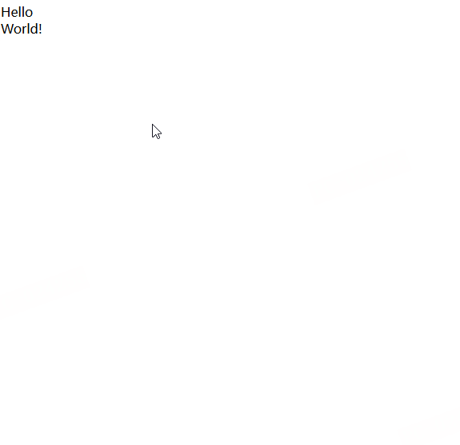

### 前置知识

#### [空白字符](https://developer.mozilla.org/zh-CN/docs/Glossary/Whitespace)

+ 空白字符（whitespace）指用于在其他字符之间提供水平或垂直空间的字符
+ 在HTML,CSS,JS或其他编程语言中,空白字符通常用于分隔标记符

+ 在HTML中: Infra 动态标准将五个字符定义为“ASCII 空白字符”：U+0009 TAB、U+000A LF、U+000C FF、U+000D CR 和 U+0020 SPACE。
+ 在JS中: ECMAScript 语言规范将这几个 Unicode 码点定义为“空白字符”：`U+0009 CHARCHTER TABULATION（<TAB>）`、`U+000B LINE TABULATION（<VT>）`、`U+000C FORM FEED（<FF>）`、`U+0020 SPACE（<SP>）`、`U+00A0 NO-BREAK SPACE（<NBSP>）`、`U+FEFF ZERO WIDTH NO-BREAK SPACE（<ZWNBSP>）`，以及任何其他 `Unicode“Space_Separator”`码位（<USP>）

#### 行内格式化上下文(IFC)和块元素格式化上下文(BFC)对空白字符的处理的不同

+ [空白符](https://developer.mozilla.org/zh-CN/docs/Web/API/Document_Object_Model/Whitespace#%E4%BB%80%E4%B9%88%E6%98%AF%E7%A9%BA%E7%99%BD%E7%AC%A6%EF%BC%9F)是指任何仅由空格、制表符或换行符（准确地说，是 CRLF 序列、回车或换行）组成的文本串。

##### IFC对空白,TAB,换行符的处理
+ 将所有的空格显示为“◦”，所有的制表符显示为“⇥”，所有的换行符显示为“⏎”：
```HTML
<h1>   Hello
        <span> World!</span>   </h1>

<!--
<h1>◦◦◦Hello◦⏎
⇥⇥⇥⇥<span>◦World!</span>⇥◦◦</h1>
-->
```

+ 最终展示效果

+ `<h1>`元素只包含行内元素，实际上包含：

一个文本节点（包含一些空格，单词“Hello”和一些制表符）。
一个行内元素（<span>，包含一个空格和一个单词“World!”）。
另外一个文本节点（只包含制表符和空格）。
正因为如此，它建立了所谓的行内格式化上下文。这是浏览器引擎可能使用的布局渲染上下文之一

+ 在这个上下文中，空白符的处理可以总结如下：

首先，换行前后的所有空格和制表符都会被忽略，所以，如果我们拿之前的示例标记：
```html
<h1>◦◦◦Hello◦⏎
⇥⇥⇥⇥<span>◦World!</span>⇥◦◦</h1>
```

然后应用这条规则，会得到：
```html
<h1>◦◦◦Hello⏎
<span>◦World!</span>⇥◦◦</h1>
```

然后，所有制表符视作空格字符，所以这个示例会变为：
```html
<h1>◦◦◦Hello⏎
<span>◦World!</span>◦◦◦</h1>
```

然后，换行符被转化为空格符：
```html
<h1>◦◦◦Hello◦<span>◦World!</span>◦◦◦</h1>
```

之后，任何紧跟在另一个空格之后的空格（甚至跨越两个独立的行内元素）都会被忽略，所以我们会得到：
```html
<h1>◦Hello◦<span>World!</span></h1>
```

最后，元素开头和结尾的空格序列被删除，所以我们最终得到了：
```html
<h1>Hello◦<span>World!</span></h1>
```

#### BFC对空白,TAB,换行符的处理

+ 有以下html
```html
<body>
  <div>  Hello  </div>

   <div>  World!   </div>
</body>

<!--
<body>⏎
⇥<div>◦◦Hello◦◦</div>⏎
⏎
◦◦◦<div>◦◦World!◦◦</div>◦◦⏎
</body>
-->

```

+ 浏览器最终渲染效果如图

1. 因为我们在块格式化上下文内，所有部分必须是一个块，所以我们的 3 个文本节点也会组成各自的“块”，就像这 2 个 <div> 一样。块占据了可用的全部宽度，并且相互堆叠，这意味着，从上面的示例开始：
```HTML
<body>⏎
⇥<div>◦◦Hello◦◦</div>⏎
⏎
◦◦◦<div>◦◦World!◦◦</div>◦◦⏎
</body>

```

我们会得到一个由多个“块”组成的布局：
```HTML
<block>⏎⇥</block>
<block>◦◦Hello◦◦</block>
<block>⏎◦◦◦</block>
<block>◦◦World!◦◦</block>
<block>◦◦⏎</block>
```

2. 然后通过对这些块应用行内格式化背景下的空白处理规则来进一步简化：

```html
<block></block>
<block>Hello</block>
<block></block>
<block>World!</block>
<block></block>
```

### [white-space](https://developer.mozilla.org/zh-CN/docs/Web/CSS/white-space)

+ white-space CSS 属性用于设置如何处理元素内的空白字符
+ 这个属性指定了两件事：
  + 空白字符是否合并，以及如何合并。
  + 是否换行，以及如何换行。
>  要使单词可以在其内部被截断，请使用 overflow-wrap、word-break 或 hyphens 代替。

+ white-space 属性有六个关键字值：normal(默认值) | nowrap | pre | pre-wrap | pre-line | break-spaces

| 值                 | 换行符 | 空格和制表符 | 文本换行 | 行末空格       | 行末的其他空白分隔符 |
| ------------------ | ------ | ------------ | -------- | -------------- | -------------------- |
| **`normal`**       | ❌ 合并 | ❌ 合并       | ✅ 换行   | ❌ 移除         | ⚠️ 挂起               |
| **`nowrap`**       | ❌ 合并 | ❌ 合并       | ❌ 不换行 | ❌ 移除         | ⚠️ 挂起               |
| **`pre`**          | ✅ 保留 | ✅ 保留       | ❌ 不换行 | ✅ 保留         | ❌ 不换行             |
| **`pre-wrap`**     | ✅ 保留 | ✅ 保留       | ✅ 换行   | ⚠️ 挂起         | ⚠️ 挂起               |
| **`pre-line`**     | ✅ 保留 | ❌ 合并       | ✅ 换行   | ❌ 移除         | ⚠️ 挂起               |
| **`break-spaces`** | ✅ 保留 | ✅ 保留       | ✅ 换行   | ✅ 换行触发断行 | ✅ 换行触发断行       |

+ 合并：连续空白符（空格、制表符、换行符）被压缩为单个空格。
+ 保留：严格保留源码中的空白符（包括缩进和换行）。
+ 挂起：行末空白符存在于 DOM 中（可复制），但视觉上不显示且不占据布局空间。
+ 换行触发断行：空白符可作为换行点，强制在行末断行（如 break-spaces 的行为）。


### [word-break](https://developer.mozilla.org/zh-CN/docs/Web/CSS/word-break)

+ CSS 属性 word-break 指定了怎样在单词内断行。
+ word-break 属性有三个关键字值：normal(默认) | break-all | keep-all
+ normal
  + 使用默认的断行规则。
  + 默认断行规则会根据文本语言类型（CJK 与非 CJK）**差异化处理**，具体表现如下：

        **1. 对 CJK 文本（中文/日文/韩文）的规则**
        • **换行逻辑**：浏览器会将每个汉字、日文假名或韩文字母视为独立的断行点，**允许在字符间自由换行**。
        • 例如：`"这是中文测试文本"` 可能在任意汉字后换行。
        • **特殊限制**：标点符号（如逗号、句号）通常不会出现在行首，换行时会自动调整位置以保证排版规范。

        **2. 对 Non-CJK 文本（英文、数字等）的规则**
        • **换行逻辑**：浏览器优先在**空格、连字符（`-`）或标点符号处换行**，**不允许在单词或数字内部断行**。
        • 例如：`"ThisIsALongEnglishWordWithoutSpaces"` 默认不会在中间断开，可能导致文本溢出容器。
        • **例外情况**：如果单词或数字序列中包含连字符（如 `break-through`），则允许在连字符处换行。

+ break-all
  + 对于 non-CJK (CJK 指中文/日文/韩文)的文本，可在任意字符间进行换行。用于解决长单词数字文本溢出的问题

+ keep-all
  + CJK 文本不断行。Non-CJK 文本表现同 normal。

### [overflow-wrap(word-wrap)](https://developer.mozilla.org/zh-CN/docs/Web/CSS/overflow-wrap)

+ **标准属性名称为overflow-wrap**;
+ CSS 属性“overflow-wrap”适用于文本，用于设置浏览器是否应在原本不可断行的字符串中插入换行符，以防止文本溢出其行框。

+ overflow-wrap 属性有三个关键字值：normal(默认) | break-word | anywhere
+ normal
  + 行只能在正常的单词断点（例如两个单词之间的空格）处换行。

+ break-word
  + 与anywhere值相同，如果行中没有其他可接受的断点，则允许在任意点将通常不可断的单词换行，但在计算最小内容内在大小时不考虑断字引入的软换行机会。
  + 解释: 仅在文本溢出容器时强制在单词内部断行，但不影响容器的固有尺寸计算**。例如，当父容器设置 width: min-content（以最小内容宽度为容器宽度）时，break-word 不会改变容器宽度，仍以完整单词的尺寸为基准

+ anywhere
  + 为防止溢出，如果行中没有其他可接受的断点，则不可断的字符串（如长词或 URL）可能会在任何时候换行。在断点处不会插入连字符。在计算最小内容内在大小时，会考虑由单词换行引入的软换行机会。
  + 允许在任意字符处断行，且会主动影响容器的固有尺寸计算**。使用 min-content 时，容器宽度可能被压缩到单个字符的宽度（如英文的单个字母或中文的单个汉字）
  > 应该避免使用anywhere,因为其会影响`width: min-content;`容器的宽度,且不兼容部分低版本chrome 

